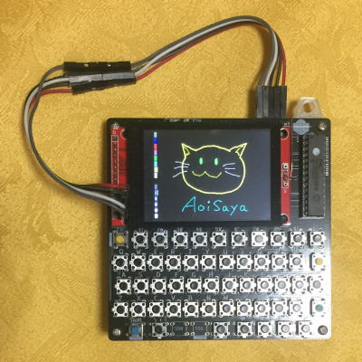
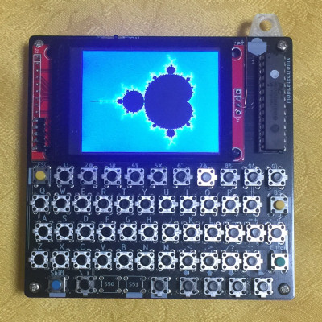

# ORANGEpico_Touch

Touch sensor XPT2046 control sample for ORANGE pico.

ORANGE pico series are small computer of PicoSoft.
Support language is BASIC.
Refer: http://www.picosoft.co.jp/orange/

## Tested equipment

Tested on "ORANGE pico pocket" purchased here.
https://booth.pm/ja/items/1134643

This pocket computer has a TFT module equipped with a touch panel controller XPT2046.
The TFT module is 2.4 inches 240 x 320 dots.
Pictures of the same product as this TFT module is shown below.

## ORANGE pico GPIO to sensor pins of TFT module connections

GPIO    | TFT module
---     | ---
PORT1   | T_IRQ
PORT2   | T_DO
PORT3   | T_DIN
PORT4   | T_CS
PORT100 | T_CLK

## Sample program

>drawing_sample.bas  `-- BASIC program sample`  
>drawing_sample.lua  `-- Sample of inputting BASIC by serial communication with Lua`
>                    `   Used in connection with FlashAir`

## Licence

[MIT](https://github.com/AoiSaya/ORANGEpico_Touch/LICENSE)

## Author

[GitHub/AoiSaya](https://github.com/AoiSaya)  
[Twitter ID @La_zlo](https://twitter.com/La_zlo)
